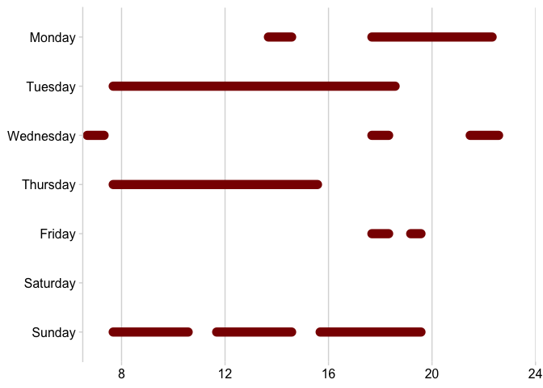

<!-- README.md is generated from README.Rmd. Please edit that file -->

# ggtrail

<!-- badges: start -->
<!-- badges: end -->

## Features

- **geom_colorpath**: Lines with alternating colors.
- **scale_aes_craftfermenter**: Extended brewer scales for binned scales
  (for color and fill aesthetic).
- **long guide ticks** for color scales (doesn’t really work yet)
- \*\*convenience scale calls that modify both x and y scales at the
  same time

## Installation

You can install the development version from
[GitHub](https://github.com/) with:

``` r
# install.packages("devtools")
devtools::install_github("tjebo/ggtrail")
```

### Examples

#### geom_roungseg

Make round segments that start and end where they should.

``` r
df_hor <- data.frame(
  x = 0, xend = 1, y = 1:3, yend = 1:3,
  linewidth = c(2, 30, 6)
)

## Works with different thickness
ggplot(df_hor, aes(x, y)) +
  geom_vline(xintercept = c(0, 1), lty = 2, linewidth = .2) +
  geom_roundseg(aes(xend = xend, yend = yend, linewidth = linewidth),
    alpha = 0.5
  ) +
  scale_linewidth_identity()
```


``` r

## For example, this can be used to make nice looking rotas
rota <- structure(list(day = structure(c(3L, 6L, 7L, 5L, 2L, 1L, 5L, 5L, 7L, 1L, 7L, 2L, 3L, 4L, 1L), levels = c("Monday", "Tuesday", "Wednesday", "Thursday", "Friday", "Saturday", "Sunday"), class = "factor"), on = c(17.5, 7.5, 17.5, 6.5, 6.5, 11.5, 17.5, 21.3, 13.5, 15.5, 21.3, 19, 19, 7.5, 7.5), off = c(18.5, 8.75, 18.5, 7.5, 7.5, 12.75, 18.5, 22.75, 14.75, 16.75, 22.75, 19.75, 19.75, 8.75, 8.75)), row.names = c(15L, 44L, 31L, 36L, 6L, 43L, 23L, 26L, 39L, 5L, 34L, 12L, 16L, 1L, 41L), class = "data.frame")

ggplot(rota) +
  geom_roundseg(aes(y = day, yend = day, x = on, xend = off),
    color = "darkred", linewidth = 4
  ) +
  scale_x_continuous(limits = c(min(rota$on), 24), expand = c(0, 0), breaks = seq(0, 24, 4)) +
  labs(y = NULL, x = NULL) +
  cowplot::theme_minimal_vgrid()
```



#### geom_colorpath

``` r
library(patchwork)

dat <- data.frame(x = seq(2,10, 2), y = seq(4,20, 4))

p1 <- ggplot(dat, aes(x = x, y = y)) +
  geom_colorpath()+
  ggtitle("Default colors")

p2 <- ggplot(dat, aes(x, y)) +
  geom_colorpath(cols = c("red", "blue"))+
  ggtitle("Two colors")

p3 <- ggplot(dat, aes(x, y)) +
  geom_colorpath(cols = c("red", "blue", "green"))+
  ggtitle("Three colors")

p4 <- ggplot(dat, aes(x, y)) +
  geom_colorpath(cols = c("red", "blue", "green", "white"))+
  ggtitle("Four colors")

wrap_plots(mget(ls(pattern = "p[1-9]")))
```


``` r

air_df <- data.frame(x = 1: length(AirPassengers), y = c(AirPassengers))

a1 <- ggplot(air_df, aes(x, y)) +
  geom_colorpath(cols = c("red", "blue", "green"))+
  ggtitle("Works also with more complex curves")

a2 <- ggplot(air_df, aes(x, y)) +
  geom_colorpath(cols = c("red", "blue", "green"), n_seg = 150)+
  ggtitle("... more color segments")

a1 / a2
```


#### An extended brewer scale for binned scales

``` r
ggplot(mtcars, aes(mpg, disp, fill = hp)) +
  geom_point(shape = 21) +
  labs(title = "Craft brewer - an extended brewer scale") +
  scale_fill_craftfermenter(
    breaks = seq(0,520,40),
    limits = c(0,520),
    palette = "Spectral",
    guide =  guide_colorsteps(even.steps = FALSE, # workaround for issues #4019/#4100
                             barheight = 15) 
  )
#> Warning: 13 colours used, but Spectral has only 11 - New palette generated
#> based on all colors of Spectral
```


#### Long ticks for color bars

(Currently not working)

    ggplot(iris, aes(Sepal.Length, y = Sepal.Width, fill = Petal.Length))+
      geom_point(shape = 21) +
      scale_fill_fermenter(breaks = c(1:3,5,7), palette = "Reds") +
      guides(fill = guide_longticks(
        ticks = TRUE,
        even.steps = FALSE,
        frame.colour = "black",
        ticks.colour = "black")) +
      theme(legend.position = "bottom")

## About reproducible scripts, and using ggplot2

This readme is not meant to dive into detail how to use `ggplot2`, an
amazing package which allows for very creative data visualization in a
fairly user-friendly manner. A good place to start learning about
ggplot2 is <http://www.cookbook-r.com/Graphs/>

First, the data needs to be prepared. I often find that especially
rather inexperienced users hesitate to manipulate / shape their data
before doing any visualization or analysis.

However, there is really no need to fret. It is an often very important
and necessary step. Actually, it can make your life much easier. And if
you follow simple precautions, you can not cause much damage to your
actual raw data.

(**Those simple precautions are**: Do not use functions in your script
or report which write a file on your disk. This may easily overwrite
your raw data! E.g. `write.csv` and friends should be used only with
utmost care.)

Any wrong assignments where you may need to rerun your scripts can be
annoying, but are in itself not detrimental (provided your scripts are
sound).

On this note, I recommend to always start in a fresh session and to make
sure that your script does not rely on objects that have not been
correctly created. This is another advantage of using rmarkdown:
Knitting your script to a report makes you aware of inconsistencies in
your script.
